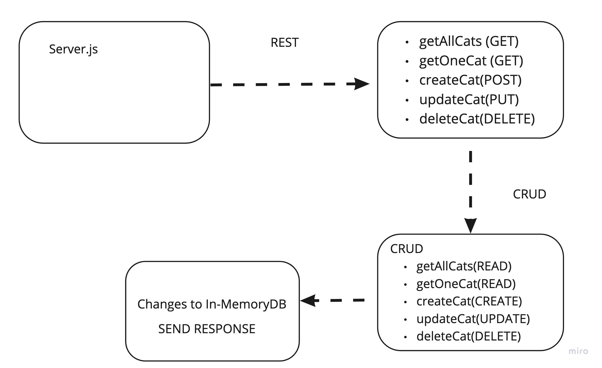

# Lab: Class 03

## Project: basic-api-server

### Author: Audrey Patterson

## Links and Resources

- [Main Branch deployed to heroku](https://audrey-basic-api-server.herokuapp.com/)
- [ci/cd](https://github.com/arpatterson31/basic-api-server/actions)
- [Pull Request dev to main](https://github.com/arpatterson31/basic-api-server/pull/1)

### Setup

#### `.env` requirements (when applicable)

i.e.

- `PORT` - 3333

#### How to initialize/run your application (where applicable)

- e.g. `npm start`

#### Tests

- How do you run tests?
  - run `npm test` in the terminal from root
- Any tests of note?
  - 404 on a bad route
  - 404 on a bad method
  - Correct status codes and returned data for each REST route
    - Create a record using POST
    - Read a list of records using GET
    - Read a record using GET
    - Update a record using PUT
    - Destroy a record using DELETE
- Describe any tests that you did not complete, skipped, etc

#### UML / Application Wiring Diagram

